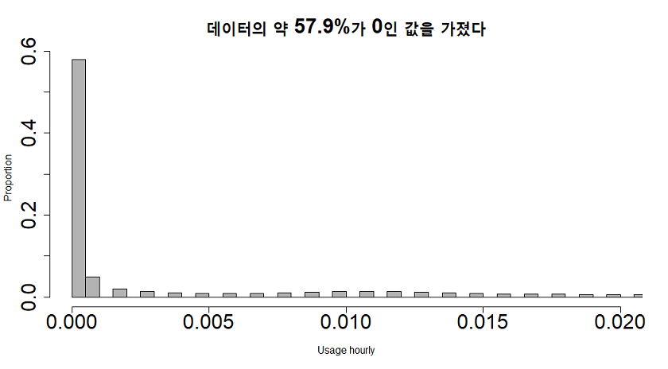
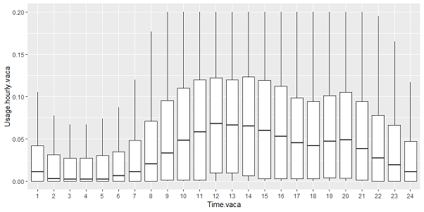

### 목차 

- [0.공모전 개요](#0-공모전-개요)
- [1. 분석목표 정하기](#1-분석-목표-정하기)
    + [1-1. 사용한 데이터](#1-1-사용한-데이터)
    + [1-2. EDA](#1-2-eda)
        * [진행 도중 겪은 어려움들](#진행-도중-겪은-어려움들)
- [2. 전처리](#2-데이터-전처리)
    + [2-1. 결측치](#2-1-결측치-처리)
    + [2-2. 이상치](#2-2-이상치-처리)
- [3. Feature Engineering](#3-feature-engineering) 
    + [3-1. 날짜 변수](#3-1-날짜변수)
    + [3-2. 공휴일 변수](#3-2-공휴일-변수)
    + [3-3. 수용가별 범주화](#3-3-수용가-범주화)
- [4. 모델링](#4-모델링)
    + [4-1. Quantile Regression](#4-1-quantile-regression)
    + [4-2. 의사결정나무 & 랜덤포레스트](#4-2-의사결정나무--랜덤포레스트)
    + [4-3. 시계열분석](#4-3-시계열-분석)
- [5. 분석결과의 적용](#5-분석결과의-적용)
- [Appendix](#appendix)
    + [A. 아쉬운 점들](#A-아쉬웠던-것들)
    + [B. 공모전을 통해 배운 것들](#B-공모전을-통해-배운-것들)

 

*** 

# 0. 공모전 개요 

- 2018년 6월에 수자원공사에서 [2018 대국민 빅데이터 분석과제 공모전](https://www.kwater.or.kr/news/repoView.do?brdId=KO26&s_mid=36&seq=104197)에 참가
- **주최측에서 제시한 주제** : 실시간 물수요 예측
- **공모전 준비기간** : 2018.06.22 ~ 2018.07.12 (약 3주)
- **공모전 결과** : 입선  
- **구성원 역할** 
    + **김동규** : 자료검색, 보고서담당
    + **양명철** : 자료검색, 외부연락담당, 시계열 분석 
    + **임예림(본인)** : 팀장, 시각화, Quantile Regression분석 
    + **정수린** : PPT담당, DB구축
    + **최재훈** : 모델링, 의사결정나무 분석, 시각화

 

***
# 1. 분석 목표 정하기

#### 분석 목표를 어떻게 정하나

공모전에서 제일 어려웠던 부분. 아래 3가지 결정하는게 어려웠습니다. 

> 1. 분석을 통해 도출하고 싶은 내용이 구체적으로 무엇인지  
> 2. 반응변수와 독립변수를 무엇으로 설정해야할지  
> 3. 유의미한 의미를 도출할 수 있을지   

이를 위해 관련분야 교수님을 3분 만나 인터뷰했고  
아래 5가지 사실을 배웠습니다.  

####  교수님 면담을 통해 배운 5가지

> 1. 분석 목표를 잘 정하기 위해서는 **EDA**가 잘 되어있어야 한다.  
> 2. **EDA**로부터 **문제상황**을 정의할 수 있고,  
> 3. **문제상황**으로부터 구체적인 **분석목표**를 정할 수 있다.   
> 4. **분석목표**로부터 **분석과정**이 도출되고  
> 5. *이러한 과정을 거치면 대체로 **유의미한 결과**를 도출할 수 있다.*  
> 위 과정이 없이 분석한다면 좋은 결과를 얻을 수 없다.  

#### 위 내용을 통해 내린 결론 

> 1. **시간별 사용량**(hourly usage)을 반응변수로 두자.   
>   현재 가진 데이터는 15개월치 밖에 없어 *계절적인 추세를 살펴보기 어렵다*.  
>   따라서 날짜별 사용량은 반응변수로 두기에 적합하지 않다.  
>   오히려 시간별 사용량을 두는 것이 적합하겠다.  
> 2. EDA를 통해 시간별 사용에 **영향을 미치는 요소**에 무엇이 있을지 살펴보자.  
> 3. EDA를 통해 발견한 내용을 **모델링에 반영**하자.  
> 4. 모델로 부터 도출한 결과를 활용해 **물절약 방안을 제시**하자.  

 

## 1-1. 사용한 데이터

- **water_usage_dataset.csv**  
실시간 물 사용량 데이터. (약 1,600만건. 수자원 공사 제공)  
충남 서산시 팔봉면에서 15개월 동안 [스마트 미터기](http://www.sommeliertimes.com/news/articleView.html?idxno=2907)를 통해 수집했습니다.   

- **customer_info.csv**  
수용가 정보 (수자원 공사 제공)  
각 가구별 정보 (약 1,600가구. 주소, 업종, 구경, 급수상태)  

- **climate.csv**  
강수량 & 기온 ([기상청 제공](https://data.kma.go.kr/data/rmt/rmtList.do?code=410&pgmNo=571))  
강수량 및 기온이 물 사용량에 미치는 영향을 살피기 위해 사용했습니다.  
RamdomForest으로 분석할 때  사용되었습니다.   

   

 
 

## 1-2. EDA

**살펴본 사항들**

1. 결측치가 있는가. 결측치들 사이에 일정한 패턴이 있는가. 
2. 이상치가 있는가. 얼마나 많이 차이가 나는가. 이상치를 제거할 수 있는가. 
3. 오류값이 있는가. 존재할 수 없는 데이터가 있는가. (예 : 26시)
3. 시간별 물 사용 패턴에는 어떤 특징이 있는가. 
4. 물 사용에 영향을 주는 요인이 있는가. (예 : 요일, 공휴일, 업종)
4. 특이한 패턴을 보이는 수용가가 있는가. 
5. 비슷한 패턴을 띄는 수용가들끼리 묶을 수 있는가. 왜 비슷한 패턴을 보이는가.

 

**발견한 사실들** 

##### 0. 사용량이 0인 데이터가 전체의 절반이상 차지하고 있습니다.  

 

##### 1. 평균에 비해 100배 많은 물을 사용하는 집단이 있어, 전체 데이터가 왜곡됩니다.

 이 집단에 대한 적절한 대처가 있어야 올바른 분석이 수행될 수 있겠다.  
 ex) 도축장

##### 2. 오류값과 결측치는 전체의 1%도 되지 않으니 과감하게 삭제하자.  

##### 3. 일반가정수용가과 사업장 사이에 물 사용 패턴 차이가 존재합니다.  

> 일반 가정은 아침, 저녁에 많이 사용하고 분산이 적습니다.  

> 반면 사업장들은 업무시간에 주로 사용. 분산이 매우 큽니다. 사업장by사업장  

##### 4. 요일과 공휴일에 따른 차이가 있습니다.  

가정은 주말에 더 많이 사용  
사업장은 주중에 더 많이 사용.  

##### 5. 사용 패턴에 따라 4가지 집단으로 나뉠 수 있겠습니다. 

- **대수용가** 
    - **초대수용가** 특징 : 다른 수용가에 비해 최소 100배 이상 많이 사용
    - **관광수용가** 특징 : 식당, 펜션과 같이 주말에 장사를 많이 하는 특징을 보입니다.
    - **일반 대수용가** 특징 : 대수용가 중 관광수용가 제외 나머지 수용가. 초등학교, 소방서, 연수원 등
- **가정수용가** 특징 : 가정에서 사용하는 물

> 아래 그림을 보면 범주에 따라 물 사용패턴이 극명하게 갈리는 것을 발견할 수 있습니다.  
> 빨간선은 대수용가(초대수용가+관광수용가+일반대수용가)  
> 파란선은 가정수용가입니다.  

 

### 진행 도중 겪은 어려움들

#### 1. 공모전 진행 속도가 더딤  

**문제상황** 
R 패키지 `dplyr`와 `ggplot`에 능숙하지 못한 구성원들이 있었습니다.  
**해결방법**  
변형해서 사용할 수 있는 기본 예제 코드를 만들고, 주석을 달아 구성원들에게 배포.  
**효과**  
코딩에 능숙하지 못한 구성원들도 빠르게 데이터를 살펴볼 수 있게 되었습니다.  

<!-- > 아래처럼 기본 예제를 만들어서 누구든 손쉽게 따라할 수 있도록 구성원들에게 배포했습니다.  -->

<!--  -->

  

#### 2. RAM 부족문제 

**문제상황**  
램 부족으로 세션이 수시로 만료되는 상황 발생  
**해결방법**  
*DB처럼 필요한 데이터만 그때그때 꺼내 쓰는 방법을 차용*  
 1. variable별로 쪼개 각각 csv 파일로 따로 저장  
 2. 필요할 때마다 필요한 변수만 불러들여 분석 수행  
 3. 분석 마친 후엔 데이터를 삭제해서 RAM절약.  
 
 **효과**  
 1. 분석 도중 세션 만료되는 현상 사라졌습니다. 
 2. 팀원들 간 데이터 전송 소요시간이 줄어들었습니다.  

 

*** 

# 2. 데이터 전처리 

## 2-1. 결측치 처리 

전체의 1% 미만이므로 대체법을 사용하지 않고 과감하게 삭제하도록 합니다. 

1. NA값 삭제
2. 누적사용량에 오류가 있는 값 삭제

> 누적사용량 $$\neq \sum$$ 실시간 사용량 

위와 같은 경우 삭제했습니다.

3. 존재하지 않는 데이터 삭제 

> ex) 26시, 27시와 같은 데이터 삭제했습니다.
 

## 2-2. 이상치 처리 
 
  2016-12-01 ~ 2016-12-06. 약 6일간 아무 이유없이 물 사용량이 급증하는 현상이 나타납니다.      
  스마트미터기 관리 부서에 직접 전화해서 물어본 결과, 스마트 미터기 오작동에 의한 것일 수 있다는 의견을 들었습니다.  
  해당 일자에 대해서 자료를 삭제했습니다.  

**이상치 제거 기준**
이상치로 인해 그래프가 왜곡되는 경우 이상치로 간주했습니다. 
아래 그림 처럼 2016년 12월초 데이터를 삭제하기 전에는 날짜에 따른 등락이 보이지 않지만,  
12월초 데이터를 삭제하고 나면 자료의 등락이 아주 잘 드러납니다.

 

***

# 3. Feature Engineering

## 3-1. 날짜변수

`YYYYMMDD` 형태로 저장된 데이터를 활용해 아래와 같은 변수를 새로 만들었습니다. 

- YYYY
- MM
- DD
- 요일

## 3-2. 공휴일 변수 

2016년과 2017년 달력을 참고해 공휴일 더미 변수 생성.  
15개월(447일) 중 144일의 휴일 더미 변수 생성. 

 

## 3-3. 수용가 범주화

[EDA에서 발견한 것을 토대로](#5-사용-패턴에-따라-4가지-집단으로-나뉠-수-있겠다) 물 사용 패턴을 분석해서 비슷한 그룹끼리 범주화를 진행했습니다.  

#### 범주화 기준 

- **초대수용가** : 도축장(하루 평균 65t 사용) 
- **관광수용가** :  '음식점', '숙박업소'로 구분 된 수용가
- **일반대수용가** :  물 사용량 상위 40개 수용가.  
상위 40번째부터 곡선이 완만해지는 패턴이 있습니다.  
elbow method를 활용해 상위 40번째(약 1.5t 이상)를 기준으로 '일반대수용'를 구분했습니다.   

- **가정수용가** : 나머지 수용가

## 3-3. 날씨 변수 추가 

물사용과 관련한 자료를 조사한 결과, 기온과 강수량이 물 수요 예측에 전통적으로 많이 사용된다는 것을 발견했습니다.  
기상청으로 관련 데이터를 다운받았습니다.  

     

*** 

 

# 4. 모델링 

 

## 4-1. Quantile Regression

### 방법을 사용한 이유 

- 일반적인 회귀가정으로부터 자유롭기 때문에, **비선형적이고 극단치가 많을 경우** 사용하기 좋습니다. 
- 우리 자료는 특성상 0인 자료가 절반 이상 되며, 물 사용량의 분산이 매우 큰 특징을 가지고 있습니다. 
- 따라서 각 분위마다 회귀선을 다르게 그려주는 Quantile Regression을 사용하는 것이 좋겠습니다.  
- Quantile Regression을 사용하면 **각 분위에 따라 달라지는 물 사용량의 차이를 반영**할 수 있기 때문입니다. 
- 50분위, 60분위, 70분위, 80분위, 90분위, 100분위로 나누어 분석하면 좋을 것 같아보입니다. 

> 우리가 사용한 회귀모형은 아래와 같습니다.   
> 각 수용가별로 각기 다른 모델을 만들었습니다. 
> 

> Quantile regression 의 결과를 아래와 같습니다.  
> 수용가 범주에 따른 차이가 있을 것으로 판단되어 각 수용가 범주 별로 따로 모델을 적합시켰습니다.  
> 아래를 보면 분위에 따라 각 변수의 coefficient(beta값)가 어떻게 변하는지 볼 수 있습니다. 
> 

 

### 변수 선택법 

- best subset selection 방법을 이용해 adjusted R square을 최대화 하는 변수들을 포함시켰습니다. 
- `요일`변수와 `공휴일`변수의 경우, autocorrelation의 위험이 있을 것 같아 둘 중 하나만 포함시켰습니다. 

### 결과 해석

- **초대수용가** : 데이터 수가 많지 않아 분석에서 제외 했습니다.
- **관광수용가** : 
    + *오후시간대*가 물 사용에 가장 큰 영향을 미치는 변수로 나타났습니다.  
    관광지 특성상 낮에 손님들이 많이 몰리기 때문인 것으로 보입니다. 
     이 효과는 물 사용량이 많은 사용자일수록( = 분위수가 올라갈수록) 더 커지는 경향이 있습니다.  
    + *공휴일 효과*가 양수입니다. 이를 통해 평일보다 공휴일에 더 많은 물을 사용한다는 것을 알 수 있습니다. 
- **일반대수용가** : 
    + *공휴일 효과* : 가장 많은 영향을 미치는 변수로 음의 값을 띱니다.
         이를 통해 일반대수용가의 경우, 평일에 업무하고 공휴일에 쉰다는 사실을 알 수 있습니다.
- **가정수용가** :
    + *공휴일 효과*가 음수입니다.  
       쉬는 날에 더 많은 물을 사용한다는 의미인데, 
       추측컨데, 평소 미루었던 빨래와 가사노동을 주말이나 공휴일에 몰아서 하기 때문인 것으로 추측됩니다. 이 효과 또한 분위수에 따라 더 강해지는 것으로 나타났습니다. 

  

## 4-2. 의사결정나무 & 랜덤포레스트

### 방법을 사용한 이유 

- 비모수적 모형이고 robust합니다. 
- 변수에 대한 해석이 용이합니다.
- 중위수를 기준으로 집단을 나누어 분석 진행했습니다.
- 데이터에 내재된 패턴을 이용해서 데이터를 분류하고 예측해보기 위해 사용했습니다.
- Quantile Regression에서 살펴본 요인들이 수용가들을 적절하게 분류하는지 살펴보고자 합니다. 

> 시간, 월, 기온, 강수량, 공휴일, 요일 등의 변수를 이용해  
> 시간별 물 사용량이 Z,L,M 중 어느 집단에 속하는지 분류했습니다.    
> *Z(zero) : 사용량이 0인 집단*  
>  *L(less) : 사용량이 해당 집단 중위수보다 작은 집단* 
>  *M(more) : 사용량이 해당 집단 중위수보다 큰 집단*
 
 

### 결과해석 

- **초대수용가** : 데이터 수가 부족해 분석에서 제외 했습니다.
- **관광수용가** 
    + 주말에는 새벽제외한 모든 시간에 물 사용량이 높습니다.
    + 예측률(`adjusted-R-square`) : **54.49%** / 랜덤포레스트 사용시 **65.11%**
- **일반대수용가**
    +  상위 node에 공휴일 변수가 있는 것으로 보아 공휴일 효과가 매우 큼을 알 수 있습니다. 
    +  기온 2.4 ~ 21.4 도 일 때 물 사용량이 많은 것으로 보아, 너무 춥거나 덥지 않을때 관광객이 많이 몰린다는 사실을 알 수 있습니다.  
    +  예측률(`adjusted-R-square`) : **34.34%** / 랜덤포레스트 사용시 **51.01%**
- **가정수용가**
    + 분류가 제대로 되지 않았습니다. 
    + 가정수용가의 경우 물 사용량이 0인 데이터의 비율이 높아 의사결정나무의 분류가 어려웠던 것으로 보입니다. 

 

## 4-3. 시계열 분석 

### 방법을 사용한 이유 

- 추후 물 사용량을 예상하기 위해 사용했습니다.
- 자료가 15개월치 밖에 없어 계절적인 요인을 제대로 반영하지 못하는 단점이 있습니다. 
- 대신 단일시계열 방법을 이용해 독립변수없이 물수요를 예측할 수 있는 방법을 사용했습니다. 

 

***

# 5. 분석결과의 적용

- EDA를 통해 발견한 사실들이 실제 물 사용량에 영향을 미친다는 사실을 통계모델을 통해 확인했습니다. 

- 각 수용가 범주마다 나타나는 효과의 양상은 다르지만, 공휴일이 물 사용에 가장 큰 영향을 주는 요인임을 알아냈습니다. 

### 1. 도축장 맞춤형 물 관리 방안 필요해

- 도축장과 같은 초대수용가(전체 물 사용량의 9% 차지)에 대한 집중적인 물관리가 필요합니다.
- 아래 방법을 통해 물을 절약할 수 있겠습니다. 
    1. 움직임을 감지한 물분사기 설치 
    2. 절연칼 사용을 통해 칼 세척 횟수 줄이기
    3. 정기적인 직원교육을 통해 물 사용량 줄이기 

### 2. 스마트 미터기를 app과 연동한 실시간 물 관리 수행 

1. 자신의 물 사용 정보를 토대로 '일반대수용가' '관광수용가' '가정수용가'로 분류. 
2. 각 수용가의 특징을 고려한 물 절약 정보 제공  
    **예시** : 가정수용가는 공휴일 효과가 크므로 공휴일에 물 절약과 관련된 정보 더 많이 제공 
3. 시계열 분석을 통해 추후 1개월 후 물 사용량이 얼마나 변할지 실시간 그래프로 제공.
    이어질 가뭄에 미리 대비할 수 있도록 도와줌   
4. 시뮬레이션의 예상 결과보다 물 사용량이 많을 시 **경고 알림** 제공. 

### 3. 지역축제를 활용해 물 홍보 효과를 올리자

 관광수용가의 물 사용 비율은 전체 물 사용량의 6%나 되며  
  관광업소의 물 사용량이 많은 시기를 살펴보면, 지역축제일정과 비슷한 양상을 띱니다.  

따라서 관광수용가에 대한 관리는 지역축제를 활용하면 좋겠습니다.     

**예시 방안**  

-  지역축제에서 물 절약 캠페인을 진행합니다. 
- 숙박시설에 절수형 샤워헤드를 설치합니다.  

 

***

# Appendix

## A. 아쉬웠던 것들 

> 1.분석목표를 정할 때 시간을 너무 많이 지체한 것이 아쉽습니다. 분석 목표 고민할 시간에 탐색적 분석을 시도했다면, 목표를 더 빠르게 정할 수 있지 않았을까 생각합니다.   
> 
> 2. 노트북 사양이 좋지 않아서 RAM부족으로 애먹었던 것과 모델리에 많은 시간을 지체한 것이 아쉽습니다.   
>  다음에는 더 사양 좋은 컴퓨터로 분석하거나 효율적으로 계산하는 방법을 생각해야겠습니다.  
> 
> 3. 수용가 범주화를 k-means clustering을 통해 시도해도 좋았을 것 같습니다. 
> 
> 4.  NeuralNet을 통해 실시간 물 사용량을 정확하게 예측하는 방법을 구현했더라면 더 좋았을 것 같습니다. 
> 
> 5. 통계적인 검정법을 사용하기보다 그래프만 참고하고 판단내린 점들이 아쉬웠습니다.  
> 가령 이상치를 진단할 때, bonferroni outlier test와 같은 것을 함께 활용했더라면 이상치를 더 빠르고 정확하게 발견할 수 있고, 이상치의 기준도 더 객관적으로 수립할 수 있었을 것 같습니다. 
> 
>6. 이상치를 감지하는 모델을 만들어보았으면 재미있는 시도가 되었을 것 같습니다.   물론 현재 주어진 자료에는 이상치가 많지 않아서 구현하기 힘들 것 같습니다.  하지만 더 많은 데이터가 주어진다면 스마트미터기에서 이상치를 바로 감지해내는 시스템을 개발해도 참 유용한 시도가 될 것 같습니다. 

>

## B. 공모전을 통해 배운 것들
>  1. visualization이 중요한 이유를 알았습니다.  
>  시각화를 통해 데이터에 대해 빠르게 이해할 수 있기 때문입니다.  
>  
>  2. 코드를 적고 나면 반드시 **주석**을 달아놓읍시다.  
>  공모전은 *공동작업*입니다.  
>  다른 사람도 이해할 수 있을 정도로 자세하게 주석을 달아놓아야합니다.  
>  
>  3. 분석하기 전엔 일정한 **가설**을 세우고 있어야 합니다.   
>  그래야 분석 모델을 빠르게 빨 수 있습니다.  
>  **분석목표**와 **데이터의 특성**을 염두에 두어야 원하는 결과로 빨리 다가갈 수 있습니다.   
>  무작정 모든 변수를 독립변수로 추가해서는 유의미한 결과를 얻기 힘듭니다.   
>  
>   

