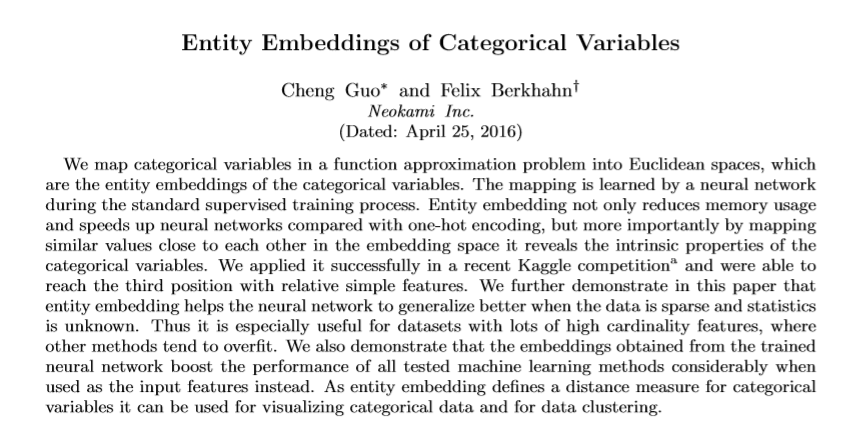

# L.point 공모전 자료조사

## Kaggle 승자의 인터뷰 정리요약

- Rossmann Store Sales 예측하는 캐글 경진대회에서 흥미로운 분석 방법이 소개되었다. 
- 살펴보도록 하자. [승자의 인터뷰 링크](http://blog.kaggle.com/2016/01/22/rossmann-store-sales-winners-interview-3rd-place-cheng-gui/)

- [3등 승자가 실제 사용한 embedding기법을 한글로 설명한 링크 ](bluediary8.tistory.com/21). 
- 원 논문 ; Entity Embeddings of Categorical Variables. [다운로드 받기](https://arxiv.org/pdf/1604.06737.pdf)

- categorical 데이터의 경우, one-hot-encoding을 이용하는 경우가 많다. 
- 하지만 이렇게 할 경우, 모델의 차원이 급격하게 늘어나는 문제가 있다. 
- 이를 예방하기 위해 embedding을 사용하면 좋다고 한다.
- embedding을 사용하면 범주형 자료를 연속형 자료처럼 표현할 수 있다.   
- 이러한 속성으로 인해 차원을 급격하게 늘리지 않고도 자료를 잘 표현할 수 있다고 한다. 
- 실제로 독일의 지역들을 embedding을 활용해 표현한 사례가 있는데, 
-  결과를 t-SNE를 활용해 2D로 표현한 결과가 시제 독일 지도와 비슷하게 보였다고도 한다. 잘 사용한다면, 이 방법이 굉장히 강력한 툴이 될 수도 있다는 것을 암시하는 대목이다. 

***

### 1. 문서로 기록을 남겨라!

[원문링크](http://blog.kaggle.com/2017/03/29/predicting-house-prices-playground-competition-winning-kernels/)  

1. 분석한 내용을 글로 표현하라. 글로 쓰다보면 문제를 어떻게 해결해야하는지 떠오른다. 
2. 피드백을 받기에 좋다. 글로 정리한 내용이 있으면 주변 사람들에게 조언받기에 용이하다. 
3. 나중에 재활용하기에 좋다. 분석했던 내용을 다시 살펴볼 일이 있을 때 참고하기 좋다. 

### 2. feature engineering에 시간을 많이 할애하라.

- parameter tuning보다, EDA와 좋은 feature engineering에 시간을 들이는 것이 좋다. 

### 3. 데이터셋 분할을 어떻게 할지 미리 잘 정하고 시작하라. 

간과하기 쉬운 부분. 
처음부터 잘 설계하지 않으면 힘든 부분. 
overfitting을 방지하려면 처음부터 데이터셋을 잘 분할해야할 필요가 있다. 
데이터의 특징을 잘 살펴서 하자!!
