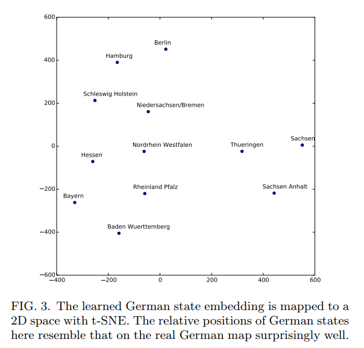

# L.point 공모전 자료조사

## Kaggle 승자의 인터뷰 정리요약

- [Rossmann Store Sales 예측하기](http://blog.kaggle.com/2016/01/22/rossmann-store-sales-winners-interview-3rd-place-cheng-gui/)

- [3등 승자가 실제 사용한 embedding기법을 한글로 설명한 링크 ](bluediary8.tistory.com/21). 
- [원 논문 링크 ; Entity Embeddings of Categorical Variables](https://arxiv.org/pdf/1604.06737.pdf)

- categorical 데이터의 경우, one-hot-encoding을 이용하는 경우가 많다. 
- 하지만 이렇게 할 경우, 모델의 차원이 급격하게 늘어나는 문제가 있다. 
- 이를 예방하기 위해 embedding을 사용하면 좋다고 한다.
- embedding을 사용하면 범주형 자료를 연속형 자료처럼 표현할 수 있다.   
- 이러한 속성으로 인해 차원을 급격하게 늘리지 않고도 자료를 잘 표현할 수 있다고 한다. 
- 실제로 독일의 지역들을 embedding을 활용해 표현한 사례가 있는데, 
-  결과를 t-SNE를 활용해 2D로 표현한 결과가 시제 독일 지도와 비슷하게 보였다고도 한다. 잘 사용한다면, 이 방법이 굉장히 강력한 툴이 될 수도 있다는 것을 암시하는 대목이다. 

