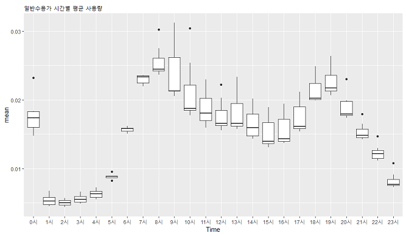

### 목차 

- [0.공모전 개요](#0-공모전-개요)
- [1. 분석목표 정하기](#1-분석-목표-정하기)
    + [1-1. 사용한 데이터](#1-1-사용한-데이터)
    + [1-2. EDA](#1-2-EDA)
        * [Troubleshootings](#troubleshootings)
- [2. 전처리](#2-전처리)
    + [2-1. 결측치](#2-1)
    + [2-2. 이상치](#2-2)
- [3. Feature Engineering](#3)
    + [3-1. 날짜 변수](#3-1)
    + [3-2. 공휴일 변수](#3-2)
    + [3-3. 수용가별 군집화하기 clustering](#3-3)
- [4. 모델링](#4)
    + [4-1. Quantile Regression](#4-1)
- [5. 결과]
- [Appendix. 공모전을 통해 배운 것들](#Appendix-공모전을-통해-배운-것들)

# 0. 공모전 개요 

- 2018년 6월에 수자원공사에서 [2018 대국민 빅데이터 분석과제 공모전](https://www.kwater.or.kr/news/repoView.do?brdId=KO26&s_mid=36&seq=104197)에 참가
- **주최측에서 제시한 주제** : 실시간 물수요 예측
- **공모전 준비기간** : 2018.06.22 ~ 2018.07.12 (약 3주)
- **공모전 결과** : 입선  
- **구성원 역할** 
    + **김동규** : 자료검색, 보고서담당
    + **양명철** : 자료검색, 외부연락담당, 시계열 분석 
    + **임예림(본인)** : 팀장, 시각화, Quantile Regression분석, SVM분석   
    + **정수린** : PPT담당, DB구축
    + **최재훈** : 모델링, 의사결정나무 분석, 시각화

 

***
# 1. 분석 목표 정하기

#### 분석 목표를 어떻게 정하나

공모전에서 제일 어려웠던 부분. 아래 3가지 결정하는게 어려웠다.

> 1. 분석을 통해 도출하고 싶은 내용이 구체적으로 무엇인지  
> 2. 반응변수와 독립변수를 무엇으로 설정해야할지  
> 3. 유의미한 의미를 도출할 수 있을지   

이를 위해 관련분야 교수님을 3분 만나 인터뷰했고  
아래 5가지 사실을 배웠다.  

####  교수님 면담을 통해 배운 5가지

> 1. 분석 목표를 잘 정하기 위해서는 **EDA**가 잘 되어있어야 한다.  
> 2. **EDA**로부터 **문제상황**을 정의할 수 있고,  
> 3. **문제상황**으로부터 구체적인 **분석목표**를 정할 수 있다.   
> 4. **분석목표**로부터 **분석과정**이 도출되고  
> 5. *이러한 과정을 거치면 대체로 **유의미한 결과**를 도출할 수 있다.*  
> 위 과정이 없이 분석한다면 좋은 결과를 얻을 수 없다.  

#### 위 내용을 통해 내린 결론 

> 1. **시간별 사용량**(hourly usage)을 반응변수로 두자.   
>   현재 가진 데이터는 15개월치 밖에 없어 *계절적인 추세를 살펴보기 어렵다*.  
>   따라서 날짜별 사용량은 반응변수로 두기에 적합하지 않다.  
>   오히려 시간별 사용량을 두는 것이 적합하겠다.  
> 2. EDA를 통해 시간별 사용에 **영향을 미치는 요소**에 무엇이 있을지 살펴보자.  
> 3. EDA를 통해 발견한 내용을 **모델링에 반영**하자.  
> 4. 모델로 부터 도출한 결과를 활용해 **물절약 방안을 제시**하자.  

 

## 1-1. 사용한 데이터

- **water_usage_dataset.csv**  
실시간 물 사용량 데이터. (약 1,600만건. 수자원 공사 제공)  
충남 서산시 팔봉면에서 15개월 동안 [스마트 미터기](http://www.sommeliertimes.com/news/articleView.html?idxno=2907)를 통해 수집했다.   

- **customer_info.csv**  
수용가 정보 (수자원 공사 제공)  
각 가구별 정보 (약 1,600가구. 주소, 업종, 구경, 급수상태)  

- **climate.csv**  
강수량 & 기온 ([기상청 제공](https://data.kma.go.kr/data/rmt/rmtList.do?code=410&pgmNo=571))  
강수량 및 기온이 물 사용량에 미치는 영향을 살피기 위해 사용했다.  
RamdomForest으로 분석할 때  사용되었다.   

   

 
 

## 1-2. EDA

**살펴본 사항들**

1. 결측치가 있는가. 결측치들 사이에 일정한 패턴이 있는가. 
2. 이상치가 있는가. 얼마나 많이 차이가 나는가. 이상치를 제거할 수 있는가. 
3. 오류값이 있는가. 존재할 수 없는 데이터가 있는가. (예 : 26시)
3. 시간별 물 사용 패턴에는 어떤 특징이 있는가. 
4. 물 사용에 영향을 주는 요인이 있는가. (예 : 요일, 공휴일, 업종)
4. 특이한 패턴을 보이는 수용가가 있는가. 
5. 비슷한 패턴을 띄는 수용가들끼리 묶을 수 있는가. 왜 비슷한 패턴을 보이는가.

 

**발견한 사실들** 

0. 사용량이 0인 데이터가 전체의 절반이상 차지하고 있다.  

 

1. 평균에 비해 100배 많은 물을 사용하는 집단이 있어, 전체 데이터가 왜곡된다.  
 이 집단에 대한 적절한 대처가 있어야 올바른 분석이 수행될 수 있겠다.  

2. 오류값과 결측치는 전체의 1%도 되지 않는다. 삭제하자.  

3. 일반가정수용가과 사업장 사이에 물 사용 패턴 차이가 존재한다.  
일반 가정은 아침, 저녁에 많이 사용하고 분산이 적다.  

사업장들은 업무시간에 주로 사용. 분산이 매우 크다. 사용량이 사업장by사업장  

4. 요일과 공휴일에 따른 차이가 있다.  
가정은 주말에 더 많이 사용  
사업장은 주중에 더 많이 사용.  

5. 사용 패턴에 따라 4가지 집단으로 나뉠 수 있겠다.  

- 초대수용가 (다른 수용가에 비해 최소 100배 이상 많이 사용)
- 대수용가 (그 외 물을 많이 사용하는 수용가 )
- 관광수용가 (식당, 펜션과 같이 주말에 장사를 많이 하는 수용가)
- 일반가정수용가 (가정에서 사용하는 물)

 

### Troubleshootings

##### 1. 공모전 진행 속도가 더딤  

**문제상황** 
R 패키지 `dplyr`와 `ggplot`에 능숙하지 못한 구성원들이 있었다.  
**해결방법**  
변형해서 사용할 수 있는 기본 예제 코드를 만들고, 주석을 달아 구성원들에게 배포.  
**효과**  
코딩에 능숙하지 못한 구성원들도 빠르게 데이터를 살펴볼 수 있게 됨.  

  

##### 2. RAM 부족문제 

**문제상황**  
램 부족으로 세션이 수시로 만료되는 상황 발생  
**해결방법**  
*DB처럼 필요한 데이터만 그때그때 꺼내 쓰는 방법을 차용*  
 1. variable별로 쪼개 각각 csv 파일로 따로 저장  
 2. 필요할 때마다 필요한 변수만 불러들여 분석 수행  
 3. 분석 마친 후엔 데이터를 삭제해서 RAM절약.  
**효과**  
 1. 분석 도중 세션 만료되는 현상 사라짐  
 2. 팀원들 간 데이터 전송 소요시간이 줄어듬  

 

*** 

# 2. 데이터 전처리 

## 2-1. 결측치 처리 

전체의 1% 미만이므로 대체법을 사용하지 않고 과감하게 삭제하도록 한다. 

1. NA값 삭제
2. 누적사용량에 오류가 있는 값 삭제

> 누적사용량 $\neq \sum$ 실시간 사용량 

위와 같은 경우 삭제했음.

3. 존재하지 않는 데이터 삭제 

> ex) 26시, 27시와 같은 데이터 삭제

 

## 2-2. 이상치 처리 

2015-12-14, 2015-12-15
약 7일간 아무 이유없이 물 사용량이 급증하는 현상이 나타남.  
스마트미터기 관리 부서에 직접 전화해서 물어본 결과, 스마트 미터기 오작동에 의한 것일 수 있다는 의견을 들었음.  
해당 일자에 대해서 자료를 삭제하도록 함 .

 

***

# 3. Feature Engineering

## 3-1. 날짜변수

`YYYYMMDD` 형태로 저장된 데이터를 활용해 여러가지 날짜 변수를 만들었다. 

- YYYY
- MM
- DD
- 요일

## 3-2. 공휴일 변수 

2016년과 2017년 달력을 참고해 공휴일 더미 변수 생성. 
15개월(447일) 중 144일의 휴일 더미 변수 생성. 

 

*** 

# 4. 모델링 

 

## 4-1. Qauntile Regression

### 방법을 사용한 이유 
- 일반적인 회귀가정으로부터 자유롭기 때문에, **비선형적이고 극단치가 많을 경우** 선호됨. 
- 우리 자료는 특성상 0인 자료가 절반 이상 
- 우리 데이터를 물 사용량에 따라 그 특성이 갈린다고 판단된다. 
- Quantile Regression은 각 분위마다 회귀선을 다르게 그려주기 때문에 **물 사용 구간에 따른 차이를 반영**할 수 있다.

## 4-2. SVM

### 방법을 사용한 이유 

- 회귀분석에서 알아내지 못한 변수 영향도를 detect할 수 있기 때문. 
- 회귀분석에 비해 더 민감하게 반응할 수 있음 

## 4-3. 의사결정나무 & ramdomforests

### 방법을 사용한 이유 

- 비모수적 모형이고 robust함. 
- 변수에 대한 해석이 용이함 
- 중위수를 기준으로 집단을 나누어 분석 진행
- 
- 

 

***

# 5. 결과

# 5-1. 분석에서 얻은 Insight

# 5-2. 분석결과의 적용

- (주)광축과 같이 초대수용가에 대한 집중적인 물관리가 필요하다. 
이는 절연칼 사용, 절수형 호스 사용 등으로 보완할 수 있다. 

# Appendix. 공모전을 통해 배운 것들 
>  1. visualization이 중요한 이유를 알았다.  
>  시각화를 통해 데이터에 대해 빠르게 이해할 수 있기 때문이다.  
>  
>  2. 코드를 적고 나면 반드시 **주석**을 달아놓자.  
>  공모전은 *공동작업*이다.  
>  다른 사람도 이해할 수 있을 정도로 자세하게 주석을 달아놓아야한다.  
>  
>  3. 분석 모델을 짤 때는 **분석목표**와 **데이터의 특성**을 염두에 두고 만들어야 한다.   
>  무작정 모든 변수를 독립변수로 추가해서는 유의미한 결과를 얻을 수 없다.   
>  분석하기 전엔 일정한 **가설**을 세우고 있어야 한다.   
>  그래야 원하는 결과로 더 빨리 다가갈 수 있다.   
>   

